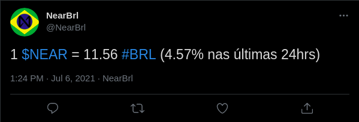

# NEAR To BRL price on Twitter

:brazil: :brazil: :brazil:

Tweeta o preço de NEAR convertido para BRL duas vezes por dia. Você pode conferir um exemplo [aqui](https://twitter.com/NearBrl).

## Configuração

Esse projeto foi feito usando `Python 3.9.6`

1. Instale as dependencias: `pip install -r requirements.txt`
2. Crie um arquivo .env: `mv .env.example .env`
3. Popule o arquivo .env com as credenciais (tutorial abaixo)
4. Rode `python3 main.py`

## Pegar Credenciais

#### CoinMarketCap
1. Acesse [CoinMarketCap](https://pro.coinmarketcap.com/signup) e crie uma conta de desenvolvedor
2. Vefique sua nova conta
3. Pegue a Api Key e adicione no .env (`CMC_API_KEY`)

#### Twitter
1. Acesse [Twitter Developer](https://developer.twitter.com/en/apply-for-access) e aplique para uma conta de desenvolvedor
2. Espere... Eles demoram algumas horas para aprovar seu pedido
3. Crie um projeto
4. Crie um app
5. Regere e pege as Consumer Keys (`TWITTER_API_KEY` and `TWITTER_SECRET_API_KEY`)
6. Regere e pege as Authentication Tokens (`TWITTER_ACCESS_TOKEN` and `TWITTER_SECRET_ACCESS_TOKEN`)

## Mude a Moeda, Texto and Tweets por dia

#### Moeda
1. Pegue a lista de moedas [aqui](https://coinmarketcap.com/api/v1/#section/Standards-and-Conventions)
2. Adiciona na env `CURRENCY_TO_CONVERT`

#### Texto
1. Adicione o texto (`nas últimas 24hrs`) no seu idioma para a env `TEXT_LAST_24_HRS`

#### Tweets por dia

1. Adicione quantos Tweets você quer que seja mandado por dia para a env `TWEETS_PER_DAY`

## Exemplo BRL

---

:us: :us: :us:

Tweets the NEAR price converted to BRL twice a day. You can check an example [here](https://twitter.com/NearBrl).

## Setup

This project was made using `Python 3.9.6`

1. Install dependencies: `pip install -r requirements.txt`
2. Create .env file: `mv .env.example .env`
3. Populate the .env file with credentials (tutorial below)
4. Run `python3 main.py`

## Get Credentials

#### CoinMarketCap
1. Go to [CoinMarketCap](https://pro.coinmarketcap.com/signup) and create an developer account
2. Verify your new account
3. Get the Api Key and add to .env (`CMC_API_KEY`)

#### Twitter
1. Go to [Twitter Developer](https://developer.twitter.com/en/apply-for-access) and apply for a developer account
2. Wait... They took some hours to accept the request
3. Create a project
4. Create an app
5. Regenerate and get the Consumer Keys (`TWITTER_API_KEY` and `TWITTER_SECRET_API_KEY`)
6. Regenerate and get the Authentication Tokens (`TWITTER_ACCESS_TOKEN` and `TWITTER_SECRET_ACCESS_TOKEN`)
## Change Currency, Text and Tweets per day

#### Currency
1. Get the currency code list [here](https://coinmarketcap.com/api/v1/#section/Standards-and-Conventions)
2. Add to the `CURRENCY_TO_CONVERT` env

#### Text
1. Add the text (`in the last 24hrs`) in your language to the `TEXT_LAST_24_HRS` env

#### Tweets per day

1. Add how many tweets you want to be send per day to the `TWEETS_PER_DAY` env
